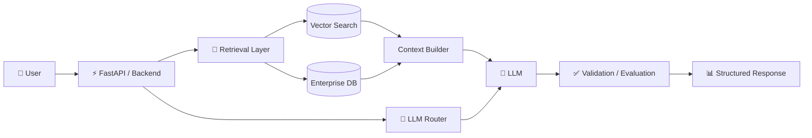

<div align="center">

# Hi, I'm Ahib Afnan Siam 👋

### AI Software Engineer · Applied AI · Backend Systems


<br>

**I build intelligent systems that turn complex data into useful products.**

`RAG` · `NL2SQL` · `Semantic Search` · `AI Agents` · `Computer Vision` · `Enterprise AI`

<br>

[](https://ahib-afnan-siam.vercel.app/)
[](https://www.linkedin.com/in/ahib-afnan-siam-585081175/)
[](https://medium.com/@ahibafnan99)
[](https://x.com/AhibSiam)

</div>

---

## `> whoami`

```yaml
name: Ahib Afnan Siam
role: AI Software Engineer
company: PRAN-RFL Group
location: Dhaka, Bangladesh

focus:
  - Retrieval-Augmented Generation
  - Natural Language to SQL
  - Semantic Search & Reranking
  - AI Agents & Automation
  - Machine Learning
  - Computer Vision
  - Scalable Backend Systems

interests:
  - Production AI Engineering
  - Enterprise AI Architecture
  - AI Reliability & Evaluation
  - Time-Series Foundation Models
```

I work on **production-oriented AI systems** — from enterprise RAG and natural-language analytics to semantic retrieval, intelligent automation, machine learning, and computer vision.

My main interest isn't simply making a model work.

I enjoy engineering the **retrieval, data, backend, evaluation, orchestration, and deployment layers** that turn AI prototypes into reliable real-world systems.

---

## 📈 Engineering Impact

<table>
<tr>
<td align="center" width="25%">

### `50M+`

**Enterprise Records**

Large-scale analytics  
& NL2SQL systems

</td>

<td align="center" width="25%">

### `10K+`

**Candidate CVs**

Semantic retrieval  
& intelligent search

</td>

<td align="center" width="25%">

### `RAG`

**Production AI**

Retrieval pipelines  
& grounded LLMs

</td>

<td align="center" width="25%">

### `NL2SQL`

**Enterprise Analytics**

Natural language  
to structured data

</td>
</tr>
</table>

---

## ⚡ What I'm Building

<table>
<tr>

<td width="50%" valign="top">

### 🧠 Uttoron

**Enterprise AI Analytics Assistant**

Natural-language access to large-scale enterprise data using schema-aware retrieval and NL2SQL.

Designed to turn complex enterprise datasets into accessible conversational analytics.

**Scale:** `50M+ enterprise records`

`RAG` `NL2SQL` `Oracle` `FastAPI` `LLM`

</td>

<td width="50%" valign="top">

### 🔎 Hire360

**AI Recruitment Intelligence Platform**

Semantic candidate discovery using vector retrieval, structured filtering, intelligent ranking, and embedding-based candidate matching.

**Scale:** `10K+ candidate CVs`

`Semantic Search` `Oracle VECTOR` `MiniLM` `FastAPI` `React`

</td>

</tr>

<tr>

<td width="50%" valign="top">

### 🎙️ MeetOS

**AI Meeting Intelligence**

AI-assisted meeting workflows combining transcription, browser automation, LLM processing, structured knowledge extraction, and intelligent post-meeting workflows.

`Whisper` `LLM` `Playwright` `FastAPI` `Automation`

</td>

<td width="50%" valign="top">

### 👁️ Computer Vision Systems

**Real-Time Vision & Recognition**

Applied computer vision systems involving object detection, facial recognition, tracking, image processing, and intelligent automation.

`PyTorch` `YOLO` `OpenCV` `Deep Learning`

</td>

</tr>
</table>

---

## 🏗️ The Kind of Systems I Build



My typical AI systems combine **retrieval, enterprise data, backend APIs, LLM orchestration, validation, and application-level intelligence** rather than relying on a standalone model.

---

## 🧩 Engineering Focus

```text
AI / LLM Systems      ███████████████████░   RAG · NL2SQL · Agents
Retrieval Systems     ███████████████████░   Vector Search · Reranking
Backend Engineering   ██████████████████░░   FastAPI · APIs · Oracle
Machine Learning      █████████████████░░░   PyTorch · Scikit-learn
Computer Vision       ████████████████░░░░   YOLO · OpenCV
Frontend              ██████████████░░░░░░   React · TypeScript
```

---

## 🛠️ Technology

### 🤖 AI & Machine Learning


`RAG` · `NL2SQL` · `LLMs` · `Vector Search` · `Semantic Search` · `Reranking` · `AI Agents`

### ⚙️ Backend & Data


`Oracle VECTOR` · `ChromaDB` · `REST APIs` · `Enterprise Data` · `Vector Databases`

### 💻 Frontend & Engineering


---

<details>

<summary><b>⚙️ More technologies I've worked with</b></summary>

<br>

Beyond my primary AI engineering stack, I've worked with technologies across software development, mobile development, ML, systems programming, robotics, and data engineering.

<br>

`Java` · `C` · `C++` · `PHP` · `.NET` · `Dart` · `Flutter` · `Django` · `TensorFlow` · `Keras` · `ROS` · `OpenGL` · `MySQL` · `LaTeX`

<br>

I prefer keeping the main stack above focused on the technologies most relevant to the systems I'm currently building.

</details>

---

## 🚧 Current Status

```python
ahib = {
    "building": [
        "Enterprise AI Systems",
        "Semantic Retrieval Systems",
        "AI-powered Analytics"
    ],

    "researching": "Time-Series Foundation Models",

    "exploring": [
        "Reliable RAG",
        "LLM Evaluation",
        "Advanced Reranking",
        "AI Reliability"
    ],

    "interested_in": [
        "Open Source",
        "AI Collaboration",
        "Applied AI Research"
    ]
}
```

### Current engineering questions

```text
→ How do we make RAG systems genuinely reliable?

→ How should retrieval quality be measured before generation?

→ How can LLM routing improve cost, latency, and accuracy?

→ How do AI systems behave when moved from prototypes to production?

→ How reliable are foundation models when distributions change?
```

---

## 📌 Featured Public Repository

<div align="center">

<a href="https://github.com/Ahib-Afnan-Siam/oracle-sql-assistant-full">
  
</a>

</div>

<div align="center">

**More projects → [github.com/Ahib-Afnan-Siam](https://github.com/Ahib-Afnan-Siam?tab=repositories)**

</div>

---

## 📊 GitHub Activity

<div align="center">


<br>


</div>

<br>

<div align="center">


</div>

---

## 🐍 Contribution Journey

<div align="center">

<p>
  Watch the snake eat my contribution graph — one commit at a time.
</p>

<picture>
  <source
    media="(prefers-color-scheme: dark)"
    srcset="https://raw.githubusercontent.com/Ahib-Afnan-Siam/Ahib-Afnan-Siam/output/github-contribution-grid-snake-dark.svg"
  />
  <source
    media="(prefers-color-scheme: light)"
    srcset="https://raw.githubusercontent.com/Ahib-Afnan-Siam/Ahib-Afnan-Siam/output/github-contribution-grid-snake.svg"
  />
  
</picture>

</div>

---

## ✍️ Latest Writing

I write about **AI engineering, machine learning, software systems, and things I learn while building real-world technology.**

<!-- BLOG-POST-LIST:START -->
<!-- BLOG-POST-LIST:END -->

<div align="center">

[](https://medium.com/@ahibafnan99)

</div>

---

<details>

<summary><b>🧩 Problem Solving & Algorithms</b></summary>

<br>

I also spend time strengthening my algorithmic problem-solving and computer-science fundamentals.

I've worked through **500+ coding and algorithmic problems**, covering areas such as:

`Dynamic Programming`  
`Graphs`  
`Trees`  
`Binary Search`  
`Greedy Algorithms`  
`Backtracking`  
`Recursion`  
`Data Structures`  
`Searching & Sorting`

<br>

Problem solving isn't the center of my professional identity, but it remains an important part of how I sharpen my engineering thinking.

</details>

---

<details>

<summary><b>🧠 How I Think About AI Engineering</b></summary>

<br>

A useful production AI system is much more than an API call to a language model.

I usually think about the system as several cooperating layers:

```text
Data
  ↓
Preparation
  ↓
Indexing / Embeddings
  ↓
Retrieval
  ↓
Ranking / Filtering
  ↓
Context Construction
  ↓
Model Routing
  ↓
Generation
  ↓
Validation
  ↓
Evaluation
  ↓
Application
```

The interesting engineering problems often live **between these layers**.

That's where retrieval quality, latency, observability, security, cost, evaluation, data quality, and system reliability become critical.

</details>

---

## 🤝 Let's Build Something Interesting

I'm particularly interested in collaborating on:

- **AI / LLM engineering**
- **RAG & retrieval systems**
- **Semantic search & reranking**
- **AI agents and automation**
- **Machine learning & computer vision**
- **Open-source AI tooling**
- **Applied AI research**
- **Scalable backend systems**

If you're building something interesting around **AI, data, intelligent software, or developer tooling**, feel free to reach out.

<div align="center">

<br>

### Build systems. Solve real problems. Keep learning.

<br>

[](https://ahib-afnan-siam.vercel.app/)
[](https://www.linkedin.com/in/ahib-afnan-siam-585081175/)

<br><br>


</div>
